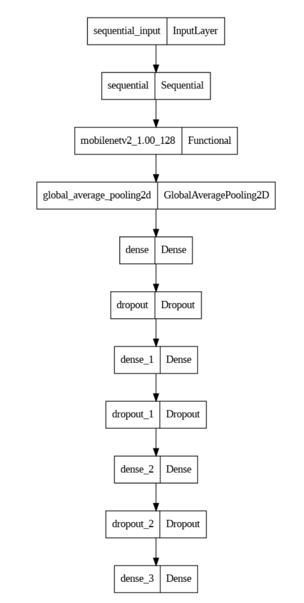
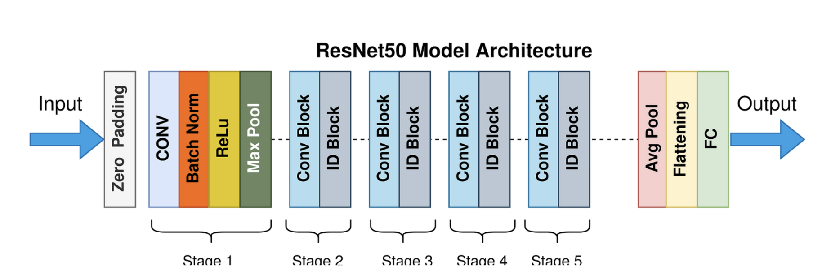

# Detecting AI-Generated Fake Images
This project generates AI images using the DALL-E2 API from OpenAI and use the generate picture to build a AI-Generated Image detector. 

#### **Duke University (MIDS) - Spring 2023**

#### **Team member**: [Pooja](https://github.com/poojakabber7), [Scott](https://github.com/ScottLL), [Emma](https://github.com/Emmawang00), [Song](https://github.com/songyoungoh)

----

Try the final webapp 🤖🤖🤖 [AI Human face generator & dectector Webapp](https://fake-image-generator-detector.streamlit.app/)

*Note: You will need OpenAI API keys to get access. Read more [how to get Openai API](https://www.windowscentral.com/software-apps/how-to-get-an-openai-api-key) 

----
Watch the project presentation video below to get more information:

----

### Project Report 
[project Report](https://github.com/nogibjj/Detecting-AI-Generated-Fake-Images/blob/main/final_report/IDS705%20Final%20Report.pdf)

---- 
## Motivation
We have witnessed significant advancements in image-generation AI models in recent years, including the impressive transformer autoregressive model DALL-E 2 developed by OpenAI. While these models have various applications, including entertainment, advertising, and architecture design, their use raises important ethical questions due to the potential misuse of AI-generated images. As such, we aim to build a machine learning model that can differentiate between AI-generated images and real human face images to promote ethical practices in their use and contribute to this significant area of study.

## Usage
- dalle2_code.py: generate AI pic and save it into Google drive. 
- localDalle2.py: Read pic from input folder and generate AI pic and save it into local output folder.
- downloaded-json: Get real human picture from V7. 
- aws_upload.ipynb: upload image into Amazon s3 bucket.
- final_output_mobielnet.ipynb: Train mobileNetv2 model using s3 and codespace
- MobileNetV2_model.py: Train MobileNetV2 model using s3 on Apple M2 GPU
- Resnet.ipynb: Train ResNet50 on Gooogle colab.
- cnn_model.ipynb: Train and test model using huggingface model on local.
- mobileNetV2_visual.ipynb: Visualize MobileNetV2 model.
- resNet_visualization.ipynb & restNet_visual.ipynb: Visualize RestNet50 using UMAP.

### install package 
To install the required packages, run the following command:

> make install 

This will install the required packages specified in the requirements.txt file.

### API Key
To use the DALL-E2 API, you will need to obtain an API key from OpenAI. Once you have an API key, create a .env file in the root directory of the project and add the following line:

> touch .env

> OPENAI_API_KEY = "YOUR_OPENAI_API_KEY"

### pipeline 

### Methodology 
We aim to develop a neural network model for detecting fake AI-generated images, drawing inspiration from previous works by Sabithaa et al. (2020), Zhang et al. (2020), and He et al. (2016). To fine-tune the pre-trained ResNet model, we will use the FFHQ dataset, which Sabithaa et al. (2020) also used as an evaluation dataset. Additionally, we will explore the performance of MobileNetV2, a lightweight version of ResNet50, to understand its effectiveness in comparison to ResNet50. Our goal is to achieve high accuracy while gaining insights into the factors influencing detection performance through model visualization.

### DallE-2 image generator
the code is in AI_generate folder, contains three different way to generate the AI image from DallE-2, local-local, S3-S3, and local-google. 

### Model processing
->  Model_processing & Model_train folder

* MobileNetV2

* ResNet50

### Visualization
After training ResNet50, we deploy the pre-trained model on HuggingFace and use it for visualization by clustering and plotting feature maps and corresponding images. The resulting plot shows that the ResNet model learns facial attributes and whether the image is real or fake, as similar images and predicted labels are grouped together. This information is encoded in the feature map of the final model layer.

----

#### Dimensionality Reduction
We also tried the images in a lower-dimensional space (2D) obtained by UMAP, which helps in identifying patterns and relations between the images. 

### Deployment 
We upload the model into huggingface and deploy the model use huggingface and streamlit 

* [Fake Image Detection](https://huggingface.co/spaces/Emmawang/Fake_image_detection). To try MobileNetV2 model.

* [AI image generator & Fake image detector](https://fake-image-generator-detector.streamlit.app/). To try AI-image generator and ResNet Fake image detector 

### Contributing
Pull requests are welcome! If you would like to contribute to this project, please fork the repository and create a new branch for your changes. Submit a pull request when you are ready to merge your changes back into the main branch.

### License
This project is licensed under the MIT License - see the LICENSE file for details.